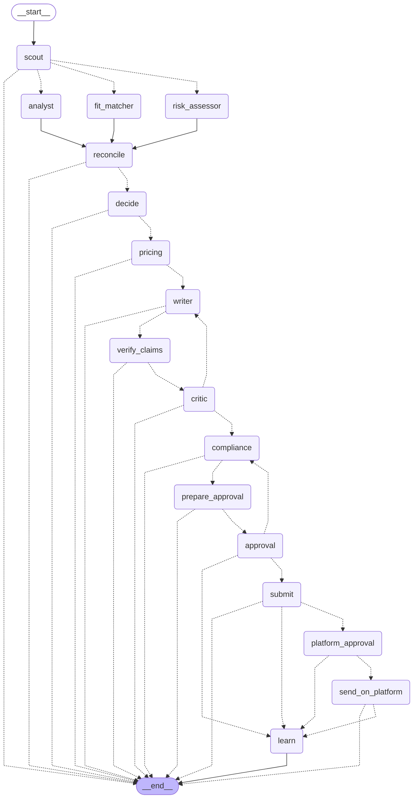
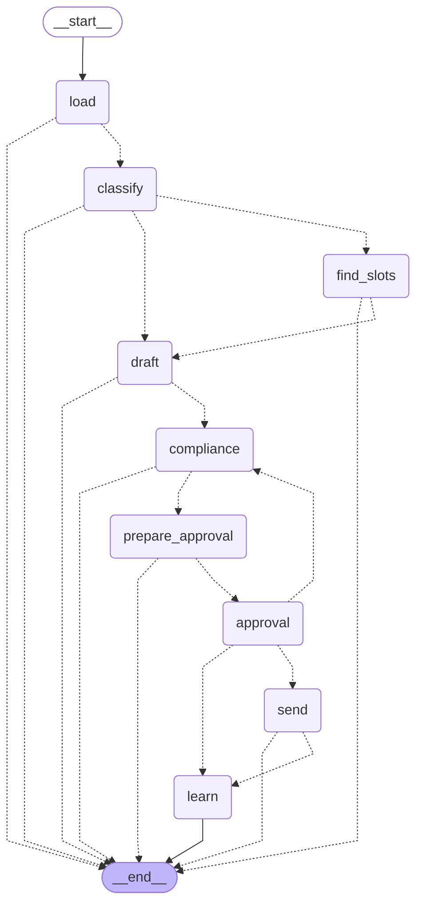

# GigBid graphs

Generated from the compiled graphs by `python -m scripts.render_graphs`. Do not edit.

## Bid graph: one thread per job

```mermaid
---
config:
  flowchart:
    curve: linear
---
graph TD;
	__start__([<p>__start__</p>]):::first
	scout(scout)
	analyst(analyst)
	risk_assessor(risk_assessor)
	fit_matcher(fit_matcher)
	reconcile(reconcile)
	decide(decide)
	pricing(pricing)
	writer(writer)
	verify_claims(verify_claims)
	critic(critic)
	compliance(compliance)
	prepare_approval(prepare_approval)
	submit(submit)
	send_on_platform(send_on_platform)
	learn(learn)
	approval(approval)
	platform_approval(platform_approval)
	__end__([<p>__end__</p>]):::last
	__start__ --> scout;
	analyst --> reconcile;
	approval -.-> compliance;
	approval -.-> learn;
	approval -.-> submit;
	compliance -.-> __end__;
	compliance -.-> prepare_approval;
	critic -.-> __end__;
	critic -.-> compliance;
	critic -.-> writer;
	decide -.-> __end__;
	decide -.-> pricing;
	fit_matcher --> reconcile;
	platform_approval -.-> learn;
	platform_approval -.-> send_on_platform;
	prepare_approval -.-> __end__;
	prepare_approval -.-> approval;
	pricing -.-> __end__;
	pricing -.-> writer;
	reconcile -.-> __end__;
	reconcile -.-> decide;
	risk_assessor --> reconcile;
	scout -.-> __end__;
	scout -.-> analyst;
	scout -.-> fit_matcher;
	scout -.-> risk_assessor;
	send_on_platform -.-> __end__;
	send_on_platform -.-> learn;
	submit -.-> __end__;
	submit -.-> learn;
	submit -.-> platform_approval;
	verify_claims -.-> __end__;
	verify_claims -.-> critic;
	writer -.-> __end__;
	writer -.-> verify_claims;
	learn --> __end__;
	classDef default fill:#f2f0ff,line-height:1.2
	classDef first fill-opacity:0
	classDef last fill:#bfb6fc
```

## Conversation graph: one thread per conversation

```mermaid
---
config:
  flowchart:
    curve: linear
---
graph TD;
	__start__([<p>__start__</p>]):::first
	load(load)
	classify(classify)
	find_slots(find_slots)
	draft(draft)
	compliance(compliance)
	prepare_approval(prepare_approval)
	send(send)
	learn(learn)
	approval(approval)
	__end__([<p>__end__</p>]):::last
	__start__ --> load;
	approval -.-> compliance;
	approval -.-> learn;
	approval -.-> send;
	classify -.-> __end__;
	classify -.-> draft;
	classify -.-> find_slots;
	compliance -.-> __end__;
	compliance -.-> prepare_approval;
	draft -.-> __end__;
	draft -.-> compliance;
	find_slots -.-> __end__;
	find_slots -.-> draft;
	load -.-> __end__;
	load -.-> classify;
	prepare_approval -.-> __end__;
	prepare_approval -.-> approval;
	send -.-> __end__;
	send -.-> learn;
	learn --> __end__;
	classDef default fill:#f2f0ff,line-height:1.2
	classDef first fill-opacity:0
	classDef last fill:#bfb6fc
```
